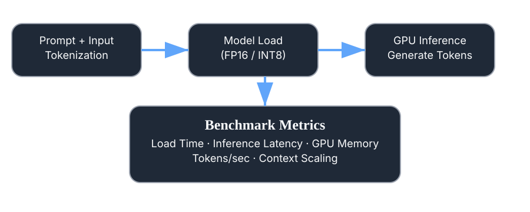
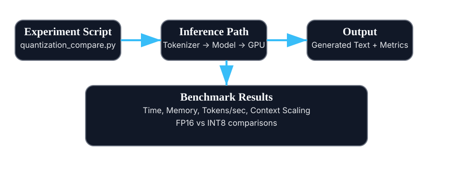

# AI Inference Lab



## Project Overview

AI Inference Lab is a hands-on benchmarking repository for transformer inference on GPU. It focuses on real-world performance comparisons of a TinyLlama causal language model using:

* FP16 and INT8 quantized inference
* Context-length scaling benchmarks
* Token generation throughput measurements
* GPU memory usage reporting

This project is built to help practitioners compare inference quality, speed, and resource consumption for efficient deployment of LLMs.

## What This Repository Contains

* `src/gpu_check.py` - validates CUDA availability and GPU device details
* `src/quantization_test.py` - loads a TinyLlama model and generates a sample response
* `src/quantization_compare.py` - compares FP16 vs INT8 model load time, inference time, and GPU memory usage
* `src/token_speed_benchmark.py` - benchmarks generation speed across increasing context lengths

## Key Features

* Model loading and inference with `transformers`
* INT8 quantization via `BitsAndBytesConfig`
* GPU performance timing and memory tracking
* Context scaling benchmarks from short prompts to very long prompts
* Step-by-step scripts for reproducible experiments

## Architecture & Benchmark Workflow



## System Requirements

Recommended environment:

* Windows or Linux with a CUDA-capable GPU
* Python 3.10+ (tested with Python 3.11)
* `torch`, `transformers`, and `bitsandbytes`
* Stable internet access for downloading the TinyLlama model

## Setup Instructions

1. Create and activate your Python environment:

```powershell
python -m venv .venv
.\.venv\Scripts\Activate.ps1
```

2. Install dependencies:

```powershell
pip install torch transformers accelerate bitsandbytes sentencepiece
```

3. Verify CUDA and GPU status:

```powershell
python src/gpu_check.py
```

## Running the Experiments

### 1. GPU Health Check

```powershell
python src/gpu_check.py
```

This script reports:

* PyTorch version
* CUDA availability
* GPU count
* GPU model name

### 2. Quantization Sanity Test

```powershell
python src/quantization_test.py
```

This script:

* loads `TinyLlama/TinyLlama-1.1B-Chat-v1.0` in FP16
* tokenizes a sample prompt
* generates an output response

### 3. FP16 vs INT8 Comparison

```powershell
python src/quantization_compare.py
```

This script performs:

* FP16 model load and inference
* INT8 model load and inference
* GPU memory measurement for both modes
* final performance comparison table

### 4. Token Throughput Benchmark

```powershell
python src/token_speed_benchmark.py
```

This script runs generation tests for four prompt sizes:

* SMALL
* MEDIUM
* LARGE
* XLARGE

It reports:

* input token count
* generated token throughput
* total generation time
* peak GPU memory usage

## Expected Results

Typical metrics you can compare with this repo:

* FP16 vs INT8 load time and inference latency
* GPU memory savings from INT8 quantization
* Tokens-per-second for different prompt lengths
* How longer contexts affect end-to-end generation time

## How to Interpret the Results

* A lower inference time means faster response generation.
* INT8 usually consumes less GPU memory, which can allow larger batch sizes or longer contexts.
* Tokens/sec captures raw throughput and is useful when comparing prompt sizes.
* Peak GPU memory shows whether a model and prompt fit on your device.

## Recommended Next Steps

* Add a results logger to save benchmark data as CSV
* Benchmark additional models and quantization levels
* Compare `load_in_8bit` with other compression techniques
* Add mixed precision / CPU fallback comparisons

## Notes

* `TinyLlama/TinyLlama-1.1B-Chat-v1.0` is the model used for all scripts.
* The repository is intended for experimentation and performance tuning rather than production deployment.

## Author

Vikram Ejjagiri

Applied AI Engineer | Intelligent Systems | Industrial AI | Robotics

